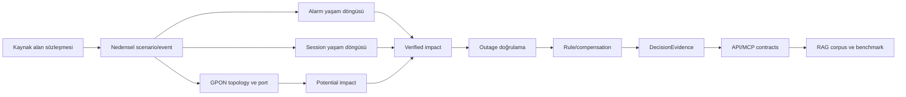

# REV-00 Impact Map

Bu harita hedef şema önermez. Yalnız `ca225f3` kodundaki mevcut bağımlılıklardan hareketle olası revizyon temas noktalarını gösterir.

| Değişiklik alanı | Model / migration olasılığı | Generator | Servis | API / MCP | Test ve doküman / RAG | Geriye uyumluluk riski |
|---|---|---|---|---|---|---|
| Alarm modelinin normalize edilmesi | `AlarmType`, `Alarm`, allowed-source/device ara tabloları; migration yüksek olasılık | Maltepe `seed_operations`, multi-city alarm catalog/timeline | alarm correlation, root cause | Network alarm/correlation/root-cause endpoint ve tool'ları | operations model/service/API/MCP contract; alarm catalog RAG | Alan adı/enum değişimi, eski raw metadata ve response contract kırılması |
| Gerçek kaynak alanlarının raw payload ile saklanması | `Alarm.metadata` yeterli olabilir veya ayrı alan/model gerekebilir; karar sonrası migration | kaynak mapper ve synthetic generator | serializer/masking, correlation | Network alarm çıktısı | güvenlik, PII ve payload fixture testleri; alarm catalog dokümanı | Ham alan sızıntısı, büyük payload, kaynak şema drift'i |
| Zaman/topoloji bazlı alarm korelasyonu | Mevcut modeller kullanılabilir; kalıcı correlation istenirse yeni model/migration | aynı nedensel olaydan zamanlı alarm üretimi | `AlarmCorrelationService`, `RootCauseService`, `TopologyService` | Network correlate/root-cause | correlation/ground-truth/MCP testleri; operasyon RAG | Mevcut skor, reason code ve sıralama değişir |
| Nedensel event/scenario instance | Mevcut tek model yok; migration olasılığı yüksek | timeline'ın ortak scenario instance üzerinden üretilmesi | outage, correlation, root cause, evidence | Network ve Compensation çıktıları | generator/regression/GT; operasyon dokümanları | Mevcut IncidentAlarm bağları ve fixture kimlikleri değişebilir |
| Session başlangıç/devam/bitiş kayıtları | Yeni model(ler) ve indeksler olası | session timeline generator | müşteri etkisi/outage doğrulama | Customer ve Network impact/history; olası yeni tool | model/service/privacy/temporal testler; RAG procedure | Kişisel veri, hacim, timezone ve geç gelen kayıtlar |
| Potential impact | Kalıcılaştırılırsa yeni model/alan; şu an servis sonucu | topology tabanlı aday üretimi | `CustomerImpactService` | customer-impact, by-device | impact ve GT testleri | Eski “affected” anlamının aday mı doğrulanmış mı olduğu belirsizleşebilir |
| Verified impact | Session kanıtı ve doğrulama durumu için yeni model/alan olası | alarm+session nedensel üretim | impact, outage, compensation precondition | Network/Customer/Compensation | evidence ve compensation regression; RAG | Müşteri sayısı, eligibility ve tutarlar değişebilir |
| Outage doğrulama durumu | `Outage.status` yeterli olmayabilir; yeni enum/alan ve migration olası | scenario yaşam döngüsü | outage duration, impact, root cause | outage detail/search ve Compensation | operations/compensation/GT | Açık/kapalı ile doğrulanmış/şüpheli semantiği karışabilir |
| GPON/OLT/PON port tutarlılığı | `NetworkDevice`, `NetworkPort`, `AccessSegment`, `LineConnection`; constraint/migration olası | network topology ve subscription/line seed | topology, path diversity, impact | Network topology/device, Customer by-device | network/generator/GT; teknik RAG | Mevcut port id'leri, teknoloji dağılımları ve fixture sayıları değişir |
| Generator'ın nedensel veri üretmesi | Şema değişmeyebilir; scenario modeli eklenirse migration | özellikle `seed_timeline`; Maltepe parity | tüm operasyon servisleri | dolaylı olarak dört MCP | seed determinism, GT ve regression | Sabit seed altında bütün ID/sayı/hash beklentileri değişebilir |
| Kural ve telafi değişiklikleri | `RuleVersion`, olası yeni version kayıtları; mevcut model değişmeyebilir | rule policy catalog, GT, compensation evidence | rule evaluation/conflict, compensation | Rule ve Compensation MCP | REFUND regression, 25-rule coverage, RAG source docs | Tarihsel v1/v2 ve tutar baseline'ı kırılabilir |
| DecisionEvidence'e doğrulama kanıtı | `DecisionEvidence` JSON alanları yeterli olabilir veya şema sürümü/migration gerekir | compensation evidence seed/persist | evidence creation | Rule evidence, Compensation evidence | evidence hash/schema testleri ve RAG açıklanabilirlik | Hash, schema version ve mevcut kanıt tüketicileri değişir |
| MCP çıktılarının değişmesi | Model şart değil | yok | backend internal serializers/views | ilgili MCP model/tool ve shared contracts | tool unit, SDK list_tools, registry/health docs | LLM/client contract kırılması; tool sayısı ve schema drift'i |
| RAG corpus'un yeniden üretilmesi | Model gerekmez; yeni SourceDocument version kayıtları olabilir | `seed_rag_corpus`, `index_rag_documents`, embedding generation | chunking, embeddings, search, benchmark | RAG internal API, Rule MCP | corpus/hash/chunk/benchmark/provider testleri | Aynı version altında içerik değiştirilemez; 74 chunk ve benchmark rank'leri değişebilir |
| Canlı simülasyon event timeline'ı | Yeni run/event state modelleri olası | scenario generator'dan runtime event üretimine geçiş | henüz orchestrator/simulation servisi yok | yeni API/MCP ileriki görev | deterministic replay, concurrency ve audit testleri | Snapshot verisi ile mutable runtime state ayrımı gerekir |

## En yüksek çapraz etki alanları

1. **Alarm→Incident nedenselliği:** `seed_timeline`, `IncidentAlarm`, correlation/root-cause, ground truth ve Network MCP birlikte etkilenir.
2. **Session tabanlı doğrulama:** yeni veri hacmi ve gizlilik sözleşmesi yanında customer impact, outage ve compensation sonuçlarını değiştirir.
3. **GPON-first gerçekçilik:** topology/port/line üretimiyle müşteri etkisi aynı revizyon zincirinde ele alınmalıdır; yalnız alarm isimlerini değiştirmek yeterli değildir.
4. **Kural değişikliği:** mevcut tarihsel `REFUND-001` ve 30/30 ground-truth baseline korunmadan uygulanmamalıdır.
5. **RAG yenileme:** domain değişikliği SourceDocument version, chunk, iki aktif embedding seti ve benchmarkı sıralı olarak etkiler.

## Revizyon sıralaması için mevcut bağımlılık yönü

Bu yön bir implementasyon kararı değildir; mevcut bağımlılıkların değişiklik yayılımını azaltacak doğal sırasını gösterir.
