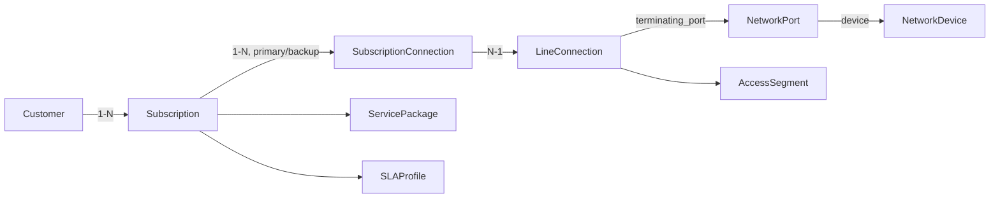
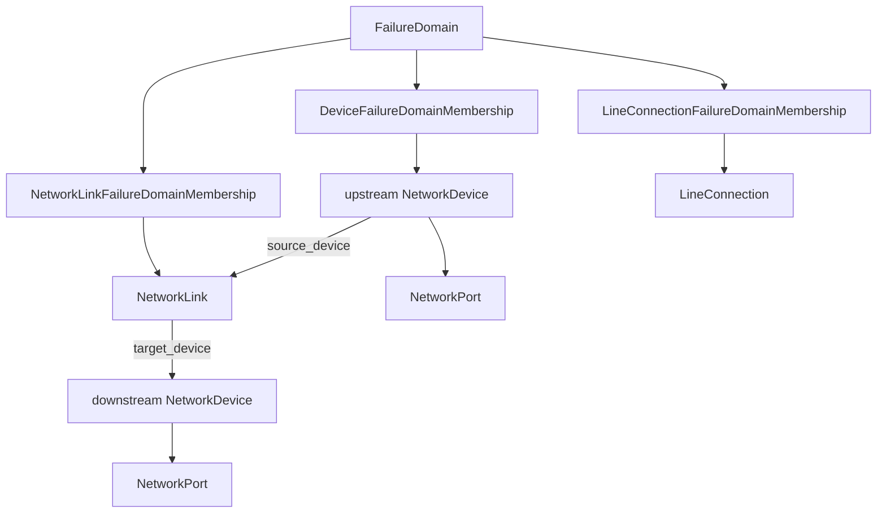
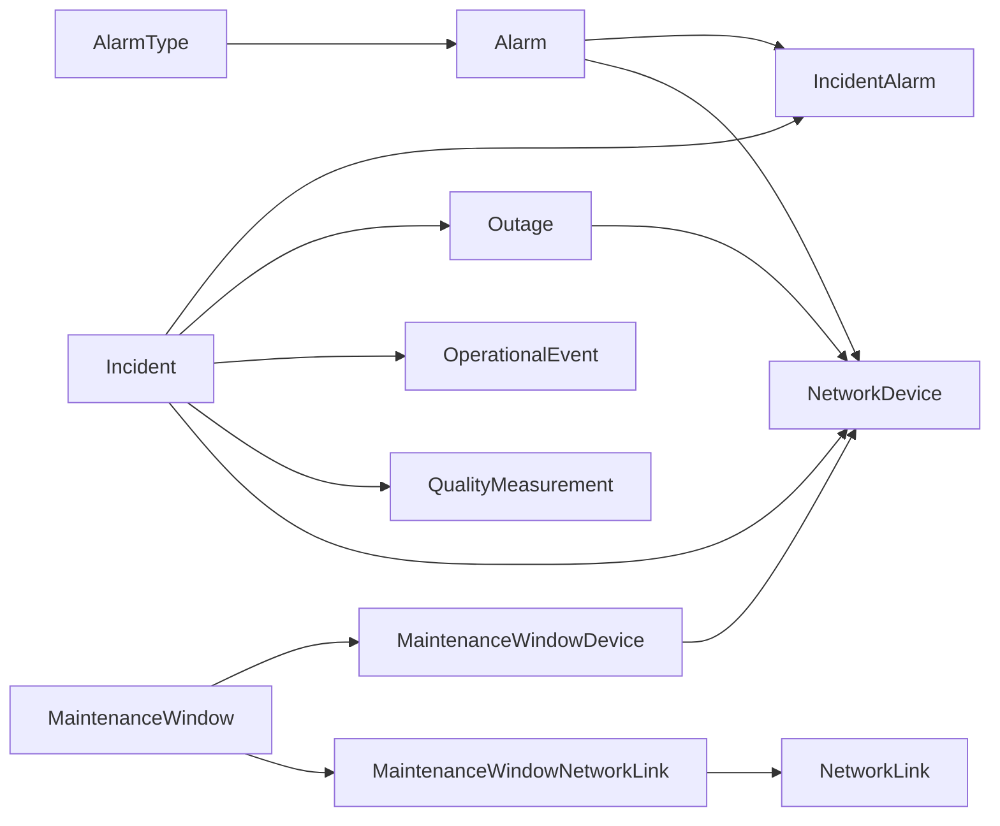
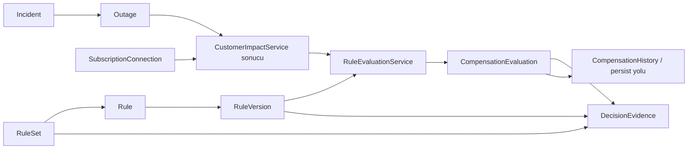
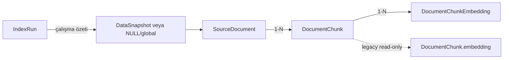
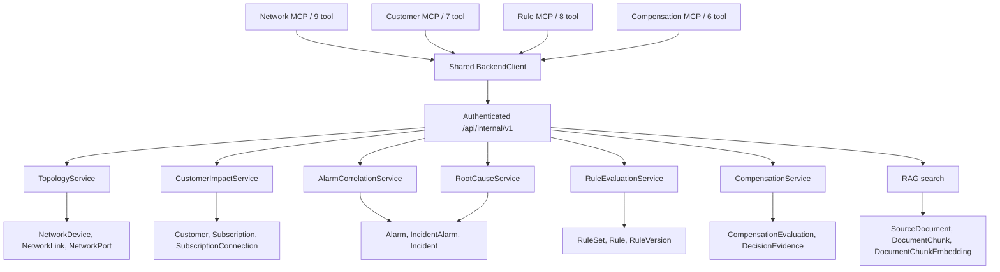
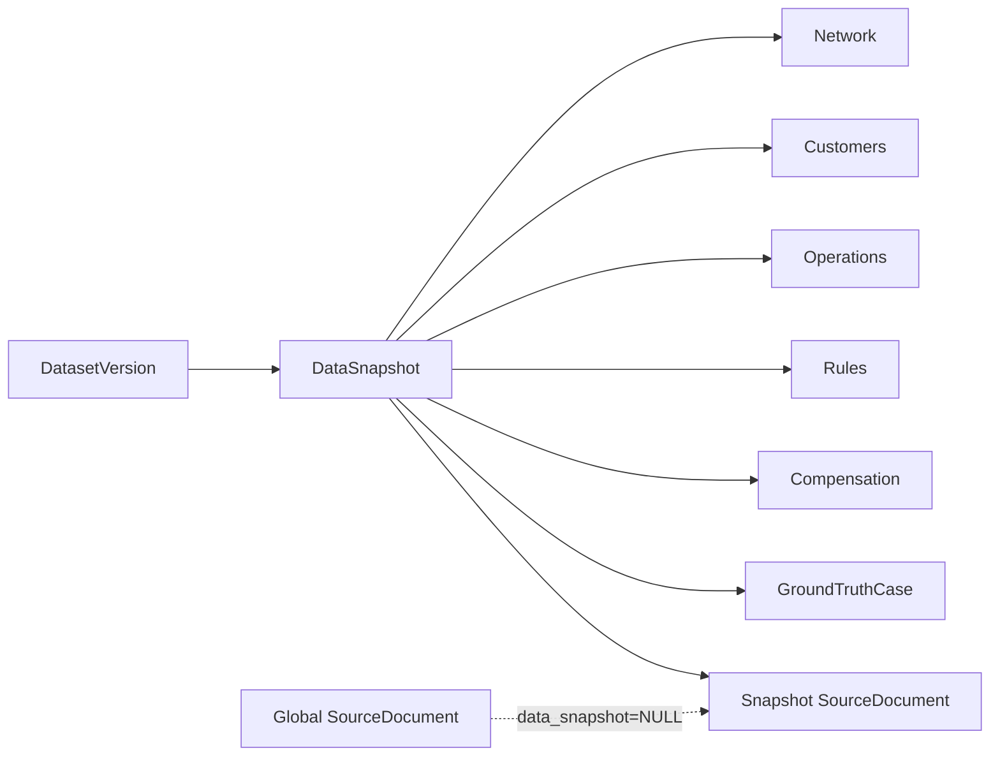

# REV-00 Model Relationships

Bu diyagramlar `ca225f3` commit'indeki Django modelleri ve servis çağrıları okunarak hazırlanmıştır. Oklar veri yönünü değil, ilişki/çağrı yönünü gösterir. Çoğu domain tablosu `DataSnapshot` ile izole edilir; coğrafya tabloları ve global RAG dokümanları istisnadır.

## 1. Müşteriden şebeke cihazına erişim

`SubscriptionConnection` zaman aralığı ve `connection_role` ile aboneliğin primary/backup hattını temsil eder. `LineConnection` erişim teknolojisi ve fiziksel/logical sonlandırma portunu taşır.

## 2. Şebeke hiyerarşisi

Topology traversal `NetworkLink` yönünü kullanır. Mevcut veride line failure-domain üyelikleri doludur; device/link üyelik tabloları boştur.

## 3. Alarm, incident ve outage

`IncidentAlarm.role` alarmın primary/supporting ilişkisini, `Outage` doğrulanmış/hesaplanmış kesinti kaydını temsil eder. Mevcut multi-city generator'da Incident→Outage nedensel olarak aynı senaryodan gelir; Alarm→Incident bağı ayrı alarm döngüsünden seçilen kayıtların sonradan bağlanmasıdır.

## 4. Müşteri etkisi, kural ve telafi

Customer impact kalıcı ayrı bir model değildir; topology ve zaman filtrelerinden deterministik servis sonucu olarak hesaplanır. `DecisionEvidence`, seçilen rule/version ile hesaplama izini kalıcı ve hash'li biçimde saklar.

## 5. RAG kaynak zinciri

Bir chunk aynı anda Gemini, aktif Qwen3 4B ve tarihsel lokal model embedding kayıtlarına sahip olabilir. Search yalnız aktif provider descriptor ile tam eşleşen `DocumentChunkEmbedding` setini kullanır.

## 6. MCP → API → servis → model

MCP process'leri Django ORM import etmez. Bearer service token, correlation ID, timeout ve güvenli hata eşleme ortak `BackendClient` sözleşmesindedir. Rule MCP'nin `search_rule_documents` aracı RAG'a erişir; Network MCP'de doküman arama aracı yoktur.

## Snapshot sınırı

Servis ve internal API'ler snapshot'ı exact `snapshot_key`, bazı sözleşmelerde yalnız tekil dataset slug ile çözer; aktif snapshot'a sessiz fallback yapılmaz.
