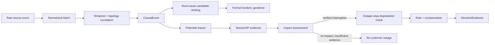

# REV-01 Hedef Operasyon Modeli

Bu tasarım `REV-00` baseline'ı, [Yusuf geri bildirimi](YUSUF_DOMAIN_FEEDBACK.md) ve proje sahibinin BTK 2026 Q1, Turkcell/KAP ve OpenConfig kaynak notları üzerinden hazırlanmıştır. Bu dış notlar tasarım girdisidir; gerçek Turkcell iç operasyon verisi, alarm sıklığı veya telafi kuralı değildir. Yusuf/Sercan örnek CSV veya logları geldiğinde alan eşlemesi ve dağılımlar ayrıca kalibre edilecektir.

## Tasarım ilkeleri

- `CONFIRMED` Alarm, tek başına müşteri kesintisini kanıtlamaz. Topoloji yalnız potential impact verir; session/IP kanıtı verified impact için gerekir.
- `DESIGN_DECISION` GPON, ilk ayrıntılı nedensel altyapıdır. BNG, aggregation, DSLAM/xDSL, Metro Ethernet, primary/backup ve failover aynı ortak modele bağlı kalır.
- `SOURCE_DERIVED` BTK oranları doğrudan seed dağılımı değildir. Fiber/FTTH büyümesi, azalan xDSL, yüksek hız ve kullanım değerleri yalnız sentetik sayıların gerçek hayattan kopmamasına yönelik kontrol sinyalidir.
- `SOURCE_DERIVED` Turkcell/KAP notları fiber ağırlıklı operatör profilini destekler; gerçek topoloji, alarm frekansı veya kurum politikası sağlamaz.
- `SOURCE_DERIVED` OpenConfig alarm id/type, resource, severity, create/clear zamanı ve component/interface referanslarını normalize alan tasarımına örnekler; kod/frekans/policy kaynağı değildir.
- `OPEN_QUESTION` “24 saatten kısa kesintide iade yok” ifadesi herhangi bir RuleVersion veya generator kuralına dönüştürülmeyecektir.

### Dış kaynak kalibrasyon sinyalleri

| Kaynak notu | Tasarımda kullanım | Kullanılmayan yorum |
|---|---|---|
| `SOURCE_DERIVED` BTK 2026 Q1: fiber yaklaşık %48,5; xDSL yaklaşık %39,3; fiberin çoğu FTTH; 50 Mbps üzeri yaklaşık %44,6; aylık kullanım yaklaşık 322,4 GB | Teknoloji, hız, trafik ve access mix değerleri için plausibility kontrolü; FTTH/GPON ve xDSL birlikte korunur | Türkiye oranlarını seed'e birebir kopyalamak; cihaz sayısı, alarm frekansı, outage veya iade kuralı çıkarmak |
| `SOURCE_DERIVED` Turkcell/KAP: sabit erişim profili daha fiber ağırlıklı; bireysel fiberde 1.000 Mbps+ göstergesi yaklaşık %20 | Sentetik operatör profilinde GPON/fiber ve yüksek hızlı paketlerin anlamlı ağırlıkta olmasını kontrol etmek | Gerçek Turkcell topolojisi, alarm kataloğu veya iç süreç varsaymak |
| `SOURCE_DERIVED` OpenConfig: id/type-id, resource, text, severity, create/clear, component/interface, oper-status/last-change | Alarm normalize alanı ve korelasyon kanıtı tasarımı | Turkcell kodları, alarm hacmi veya ticari policy üretmek |

## 1. Hedef uçtan uca operasyon akışı

### Aşamaların anlamı

| Aşama | Hedef karar | Kalıcı kanıt |
|---|---|---|
| Raw/normalized alarm | Kaynak olay tek bir device/link/port/line/failure-domain/subscription-connection kaynağına normalize edilir. | source system/external id, raw payload, severity, detected/received/clear zamanları |
| Correlation | Alarmın root, child/symptom, supporting veya unrelated/noise rolü belirlenir. | CausalEvent ilişkisi, role, zaman/topoloji/failure-domain nedenleri |
| Root cause | En güçlü aday cihaz/kaynak ve güven seviyesi seçilir; kesinlik iddiası ayrı tutulur. | ranked candidate list + evidence gaps |
| Formal Incident | Bir operatör kaydı gerekiyorsa, yeterli korelasyon veya explicit operasyon kaynağı ile Incident açılır. Her alarm için Incident açılmaz. | Incident ↔ CausalEvent, primary device, lifecycle |
| Potential impact | CausalEvent kaynağının topoloji downstream'inde, olay penceresinde aktif primary abonelik bağlantıları bulunur. | connection-level impact assessment |
| Verified impact | Session/IP kanıtı ile bağlantı bazında etki doğrulanır, reddedilir veya yetersiz kalır. | SessionEvent referansları, zaman aralığı, neden kodu |
| Outage/degradation | Operasyonel kesinti/degradation sonucu açıklanır. Customer verified impact ayrı özelliktir. | Outage verification state, impact assessment aggregate |
| Compensation | Yalnız RuleVersion'ın gerçek koşulları ve verified/insufficient kanıt politikasıyla yürür. | DecisionEvidence içinde kaynak/impact/session kanıt özeti |

### Incident ve Outage eşiği

- `DESIGN_DECISION` **CausalEvent**, ilk actionable root alarm veya aynı failure-domain/topoloji dalındaki korelasyon kümesi oluştuğunda açılır. Bu, incident candidate aşamasıdır.
- `DESIGN_DECISION` **Incident**, operatör takibi gerektiren CausalEvent için açılır: güçlü root-cause adayı, explicit operasyon olayı, planlı bakım veya belirlenen korelasyon eşiği gerekir. No-impact CausalEvent formal Incident gerektirmeyebilir.
- `DESIGN_DECISION` **Outage**, network/service interruption iddiasını taşır; verified customer impact ile eş anlamlı değildir. Tam/partial/short interruption için açılabilir, fakat `verification_state` ile `verified`, `no_customer_impact`, `insufficient_evidence` veya legacy durum ayrılır.
- `DESIGN_DECISION` **Degradation**, outage modeliyle zorla temsil edilmez. Incident/CausalEvent üzerinde degradation sonucu ve connection-level assessment ile tutulur; sadece mevcut Outage modelinin izin verdiği interruption türleri kullanılır.
- `DESIGN_DECISION` Alarm var ancak doğrulanmış müşteri etkisi yoksa Alarm + CausalEvent + assessment `no_impact` kalır; compensation çalışmaz. Session verisi eksik/gecikmişse `insufficient_evidence` kalır; “verified” yazılmaz.

## 2. Ortak nedensel olay kimliği

### Seçenek karşılaştırması

| Seçenek | Veri bütünlüğü / sorgu | Migration ve generator | API/MCP/test | Geriye uyumluluk |
|---|---|---|---|---|
| A. `metadata` içinde `event_id` | Zayıf FK yok; typo, orphan ve index sorunu; ilişki sorguları JSON'a bağımlı | İlk anda ucuz; generator karmaşıklığı gizlenir | Contract'te belirsiz; fixture doğrulaması zor | Eski kayıtlara eklenebilir ama kalıcı çözüm değildir |
| B. Mevcut bir modele FK | Incident veya Outage kök seçilirse alarm öncesi anomaly/noise ve session kanıtı yanlış semantiğe bağlanır | Null FK/backfill karmaşık; henüz Incident olmayan kümeler temsil edilemez | Her consumer kök modelin anlamını aşırı yükler | Outage'ın “verified impact” anlamına kayma riski yüksek |
| C. Yeni küçük `CausalEvent` modeli | Tek zincir kimliği, yaşam döngüsü, root candidate ve assessment için bağımsız sorgu kökü | Bir migration ve deterministik generator değişimi gerekir | API/MCP response'a isteğe bağlı causal evidence eklenebilir; fixture/GT netleşir | Eski kayıtlara nullable FK ile aşamalı backfill; legacy semantics korunur |

**`RECOMMENDATION`: Seçenek C.** `CausalEvent` bir Incident veya Outage değildir; hem gerçek/sentetik nedensel zincirin kimliği hem de correlation assessment köküdür. Önerilen minimum alanlar: `data_snapshot`, `event_code`, `event_kind`, `status`, `started_at`, `last_observed_at`, `closed_at`, `root_source` için nullable structured FK veya referans, `root_confidence`, `classification`, `metadata`, created/updated timestamps. Snapshot + event code unique olmalıdır.

Alarm, Incident, Outage, OperationalEvent, QualityMeasurement ve gelecekte SessionEvent için nullable `causal_event` FK önerilir. `IncidentAlarm` ayrıca CausalEvent içindeki alarm rolü/kanıtını taşıyacak şekilde genişletilir; alarmın birden fazla olayla ilişkilendirilebilmesi gerektiği doğrulanırsa ilişki ayrı `CausalEventAlarm` tablosuna taşınmalıdır. İlk GPON revizyonunda tek bir alarmın tek dominant CausalEvent'e ait olması invariant olarak tercih edilir; noise alarm `causal_event=NULL` kalabilir.

## 3. Session ve customer impact tasarımı

### SessionEvent

**`RECOMMENDATION`: Yeni `SessionEvent` modeli gereklidir.** Her kaynak ekran kolonu ayrı normalize alan olmaz.

| Alan grubu | Minimum hedef alan | Not |
|---|---|---|
| Kimlik | snapshot, `subscription_connection`, pseudonymized `subscriber_reference` | Gerçek subscriber/IP/MAC saklanmaz; bağlantı çözülemiyorsa pseudonymized reference geçici olarak tutulur. |
| Olay | `event_code`, `event_type` (`start`, `continue`, `stop`, `unknown`), `occurred_at`, `received_at` | Kaynak sıra ve geç geliş analizine izin verir. |
| Erişim bağlamı | `nas_identifier`, `service_identifier`, `activity_status` | Kaynak sistemde varsa normalize edilir; zorunlu değildir. |
| Durum / kullanım | `activity_result`, `download_bytes`, `upload_bytes` veya nullable aggregate | Kullanım alanları doğrulama için zorunlu değildir. |
| Kanıt | `causal_event` nullable FK, `raw_payload`, `metadata`, source system/external id | Nested activity data korunur, ancak PII redaction sözleşmesi gerekir. |

`SessionState` ilk model olarak önerilmez. Olay penceresi için state, sıralı SessionEvent'lerden hesaplanır. Yalnız yüksek hacim ölçülürse sonradan materialized/current-state projection eklenir.

### Session yorumlama kuralları

- `DESIGN_DECISION` Window öncesinde zaten `stop` durumunda olan abonelik “bu CausalEvent tarafından doğrulanmış kesinti” sayılmaz; `pre_existing_offline` reason code ile ayrı tutulur.
- `DESIGN_DECISION` Window içinde `stop` ve ardından yeni `start/continue` arasındaki süre, configured evidence window ve time ordering içinde interruption evidence olabilir.
- `DESIGN_DECISION` Backup/failover nedeniyle primary düşse dahi session devam ediyorsa `protected_no_session_loss` olarak işaretlenir; potential impact var olabilir fakat verified outage yoktur.
- `DESIGN_DECISION` Session hiç gelmez, geç gelir veya kimlik eşlemesi yapılamazsa `insufficient_evidence`; belirsizlik false positive ile kapatılmaz.
- `OPEN_QUESTION` Stop/continue eşik süreleri, NAS gecikmesi, session retention ve IP almış olmanın “hizmet sağlıklı” sayılma koşulu kaynak örnekleri geldikten sonra kalibre edilmelidir.

### Potential ve verified impact

| Yaklaşım | Değerlendirme |
|---|---|
| Mevcut hesaplanmış sonuç + yalnız DecisionEvidence | Tek değerlendirme için yeterli, ancak abonelik bazındaki no-impact/insufficient kanıtı, tekrar sorgu ve audit için yetersiz. |
| Mevcut Outage/SubscriptionConnection alanları | Outage müşteri etkisiyle, Connection da fiziksel atamayla aşırı yüklenir; tarihsel assessment kaybolur. |
| Yeni `CustomerImpactAssessment` | Potential ve verified sonucu aynı satırda, CausalEvent + SubscriptionConnection + zaman aralığı + kanıtla tutar. |

**`RECOMMENDATION`: Yeni `CustomerImpactAssessment` modeli.** Unique kimlik: `causal_event + subscription_connection + assessment_version` veya ilk revizyonda `causal_event + subscription_connection`. Alanlar: potential scope/reason, verification status (`verified`, `no_impact`, `insufficient_evidence`, `pre_existing_offline`, `protected_no_session_loss`), impact classification, window, session evidence referansları/özeti, confidence, reason codes, metadata. Verified küme, DB constraint ve validator ile potential kümenin alt kümesi olmalıdır. Aggregate customer/subscription sayıları servis sonucu olarak kalır; DecisionEvidence yalnız seçilen assessment özet/hash'lerini saklar.

## 4. Alarm-topoloji normalizasyonu

- `CONFIRMED` Mevcut `Alarm` zaten tam bir structured source FK, `raw_payload`, detected/received/ack/clear ve dedup alanlarını taşır.
- `RECOMMENDATION` OpenConfig'e benzer source-system/external-event identity, normalized resource reference ve source clear state açıklığa kavuşturulmalıdır; mevcut raw payload korunmalıdır.
- `DESIGN_DECISION` Alarm type, uygun source level ve cihaz tipiyle validator tarafından uyumlu olmalıdır. PON port alarmı OLT üzerindeki PON portuna; DSL alarmı DSLAM/xDSL line/port'a bağlanmalıdır.
- `DESIGN_DECISION` Alarm sayıları sabit katalog döngüsünden değil; teknoloji envanteri, cihaz/port kapasitesi, arıza alanı, zaman penceresi, severity, bakım ve scenario weight'lerinden türetilmelidir. Bu weights gerçek Turkcell sıklığı değildir.
- `RECOMMENDATION` Parent/child alarm ilişkisi CausalEvent içindeki role + correlation evidence ile ifade edilir; alarm type katalogta yalnız izinli ilişki family'leri tanımlanır.

Tam karar matrisi: [REV-01-ALARM-TOPOLOGY-MATRIX.csv](REV-01-ALARM-TOPOLOGY-MATRIX.csv).

## 5. GPON hedef senaryoları

### GPON-01 — OLT tamamen erişilemez

- **Başlangıç/topoloji:** OLT device; downstream PON portları, access segmentleri ve GPON line'ları.
- **Zaman:** T+0 `OLT_UNREACHABLE`; T+2m ilgili uplink/supporting alarm; T+5m PON child alarmları; T+10m session stop evidence; T+45m clear; T+50m session recovery.
- **Sonuç:** OLT alarmı root, uplink/PON alarmları child/supporting; topology potential impact; session ile verified full/partial interruption. Incident ve Outage açılır; rule/compensation yalnız verified eligible connections için değerlendirilir.
- **Invariant:** OLT root'u ile child portlar topolojik bağlı; clear, recovery'den önce veya aynı anda; verified impact potential set dışına çıkmaz.

### GPON-02 — Tek PON port arızası

- **Başlangıç/topoloji:** OLT üzerindeki tek `NetworkPort` ve ona bağlı GPON line/abonelikler.
- **Zaman:** T+0 `PON_PORT_DOWN`; T+1m `ONT_DISCONNECT_SURGE`; T+4m selected session stop; T+30m port clear; T+34m session continue.
- **Sonuç:** Port alarmı root, ONT surge symptom; yalnız ilgili port/segment potential scope'tadır. Verified partial outage ve Incident/Outage yalnız session kanıtı olanlar için compensation context üretir.
- **Invariant:** Etkilenen line'lar aynı PON porttan sonlanır; başka porttaki abonelik assessment'i olmaz.

### GPON-03 — Distribution cable/fiber segment arızası

- **Başlangıç/topoloji:** FailureDomain veya access segment / shared distribution cable; birden fazla port/OLT kapsayabilir.
- **Zaman:** T+0 `DISTRIBUTION_CABLE_DOWN` veya `FIBER_CUT_SUSPECTED`; T+3m optical loss child alarmları; T+8m port/ONT symptom kümesi; T+15m session loss; T+90m repair/clear; T+95m recovery.
- **Sonuç:** Kablo/failure-domain root, optical/ONT alarmları child. Birden fazla downstream dal potential impact alır; session kanıtı heterojen olabilir. Incident/Outage kapsamı verification aggregate ile açıklanır.
- **Invariant:** Child kaynakları root failure domain veya downstream topolojiyle ilişkili; unrelated device alarmı bağlanmaz.

### GPON-04 — Yüksek sıcaklık → degradation → alarm yayılımı

- **Başlangıç/topoloji:** OLT veya site power/cooling failure domain.
- **Zaman:** T+0 `HIGH_TEMPERATURE`; T+5m `COOLING_FAILURE`; T+20m `DEVICE_RESOURCE_HIGH`; T+40m optical quality/degradation; T+70m soğutma recovery; T+85m quality recovery.
- **Sonuç:** İlk anomaly root-cause candidate'dir, kesin outage değildir. Session'ların çoğu devam edebilir; latency/packet loss veya intermittent session evidence varsa verified degradation sınıflanır. Outage açılmaz; compensation yalnız ilerideki RuleVersion böyle bir degradation'ı kapsarsa değerlendirilebilir.
- **Invariant:** Alarm sıra ilişkisi korunur; yalnız high temperature tek başına outage üretmez.

### GPON-05 — Üst cihaz/uplink sorunu ve gecikmeli alt etkiler

- **Başlangıç/topoloji:** Aggregation/metro uplink veya OLT upstream link; birden çok OLT downstream.
- **Zaman:** T+0 `UPLINK_DOWN`; T+4m OLT reachability/quality child; T+9m selected PON/ONT symptoms; T+15m customer session evidence; T+60m link clear; T+67m recovery.
- **Sonuç:** Uplink root candidate, OLT/PON alarms child. Topology traversal zaman yönlü olmalı; 09.00 müşteri kesintisinin 08.00 upstream başlangıcı korunur. Incident/Outage root source upstream olabilir.
- **Invariant:** Root alarmın timestamp'i child'dan önce; child cihazlar upstream linkin downstream subgraph'ındadır.

### GPON-06 — Alarm var, session düşmüyor

- **Başlangıç/topoloji:** PON capacity, kısa optical warning veya non-service-impact alarmı.
- **Zaman:** T+0 warning/threshold alarm; T+5m topology potential list; T+5–T+30m session continue ve/veya trafik kanıtı; T+35m clear.
- **Sonuç:** CausalEvent `no_customer_impact`; Incident isteğe bağlı operasyon takip kaydı olabilir, Outage ve compensation yoktur.
- **Invariant:** `creates_outage=false`; verified impact 0; potential list mevcut olsa bile no-impact reasons kaydedilir.

### GPON-07 — Optical signal degradation / intermittent connection

- **Başlangıç/topoloji:** GPON line veya OLT PON port.
- **Zaman:** T+0 `OPTICAL_SIGNAL_LOW`; T+10m intermittent stop/continue; T+25m signal loss olmayabilir; T+45m normalize; T+50m stable session.
- **Sonuç:** Degradation/intermittent sınıfı; full outage varsayılmaz. Session gap'leri evidence threshold ile değerlendirilir; compensation ancak mevcut/gelecek kural açıkça izin verirse çalışır.
- **Invariant:** Signal-low tek başına root outage değildir; link/port/line source compatibility korunur.

## 6. Diğer altyapıların ortak modele bağlanması

| Altyapı | Farklı kaynak seviyesi | Ortak doğrulama | Altyapıya özgü ayrım |
|---|---|---|---|
| BNG/core | device, uplink, failure domain | downstream topology + session/IP + recovery | BNG root'u birçok access dalına yayılabilir; child cihazların gecikmeli olması beklenir |
| Aggregation | device/link/failure domain | aynı potential→verified flow | uplink/transport root, OLT/DSLAM child kümeleri |
| DSLAM/xDSL | DSL port, line, DSLAM | session start/continue/stop | retrain/line degradation full outage değildir; DSL port down port scope'unda kalır |
| Metro Ethernet | dedicated port, subscription connection, link | SLA measurement + session/service evidence | latency/jitter/packet-loss degradation'dır; full outage ile ayrı Incident/assessment sınıfı |
| Primary/backup | subscription connection ve path/failure domain | session continuity + path diversity | hitless failover `protected_no_session_loss`, outage yok; short/degraded/failed failover farklı assessment ve rule context üretir |

## 7. Backward compatibility

- `DESIGN_DECISION` Mevcut `Outage` satırları silinmez veya yeniden anlamlandırılmaz. Yeni alanlar nullable/default legacy state ile gelir; legacy kayıtlar `legacy_unverified` olarak raporlanabilir.
- `DESIGN_DECISION` Mevcut CustomerImpactService sonucu API contract'te korunur. Yeni potential/verified breakdown sürümlü veya additive response alanlarıyla eklenir.
- `DESIGN_DECISION` Mevcut MCP tool sayıları değişmeden önce backend response'ları additive tutulur. Yeni iş akışları hazır olmadan tool davranışı değişmez.
- `RECOMMENDATION` Maltepe fixed regression korunur; yeni GPON verified-impact regression ayrı dataset/snapshot veya açık version ile eklenir. Eski testler silinmez.

## 8. API, MCP ve RAG sınırı

- `DESIGN_DECISION` İlk backend değişiklikleri additive internal API alanlarıyla yapılır. Mevcut `search_alarms`, `correlate_alarms`, `rank_root_cause_candidates`, `calculate_customer_impact`, customer outage history ve compensation evidence endpoint'leri yeni kanıtları taşıyacak başlıca yüzeylerdir.
- `DESIGN_DECISION` Network MCP'nin mevcut 9, Customer MCP'nin 7, Rule MCP'nin 8 ve Compensation MCP'nin 6 aracı korunur. Yeni tool yalnız yeni iş akışının mevcut response'lara sığmaması kanıtlanırsa ayrı görevde değerlendirilir.
- `DESIGN_DECISION` MCP yalnız authenticated backend sonucu taşır; correlation, session verification veya compensation hesabını MCP process'inde tekrar uygulamaz.
- `RECOMMENDATION` `DecisionEvidence`, ham session payload yerine assessment id/hash, reason code, zaman penceresi ve kanıt özetini taşır. Raw embedding, PII veya ham erişim bilgisi response'a girmez.
- `RECOMMENDATION` RAG corpus ve benchmark, domain model/generator stabil olduktan sonra versioned olarak yenilenir. Network MCP'ye operasyon/alarm RAG aracı bu tasarım görevinin parçası değildir.

## 9. Açık kalibrasyon soruları

- `OPEN_QUESTION` Session event kimlik eşleme anahtarı, masking ve retention.
- `OPEN_QUESTION` Session stop→restart/continue kanıt eşiği, geç veri toleransı ve NAS davranışı.
- `OPEN_QUESTION` Alarm source field mapping, `DISTRIBUTION_CABLE_DOWN` gerçek kaynak seviyesi ve clear semantics.
- `OPEN_QUESTION` GPON PON port kapasitesi/topoloji derinliği ile gerçekçi scenario weights.
- `OPEN_QUESTION` Degradation'ın rule/compensation kapsamı; 24 saat iade iddiası dahil tüm ticari policy detayları.
